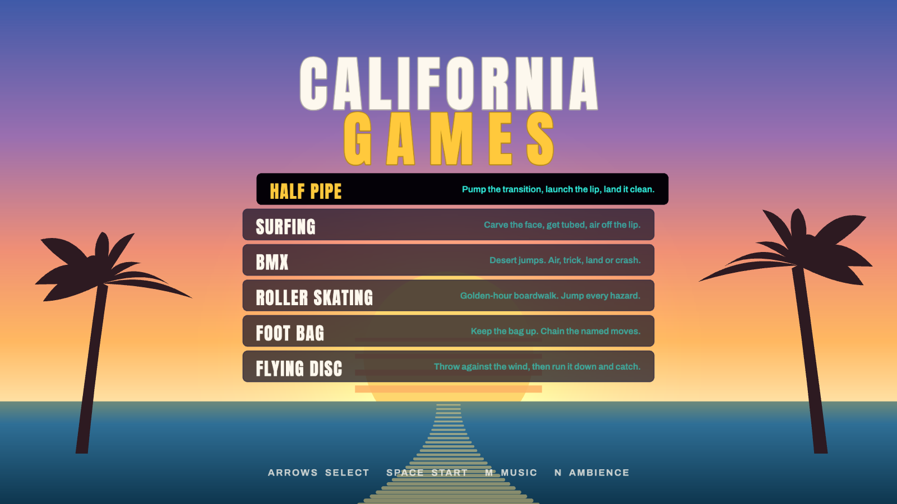
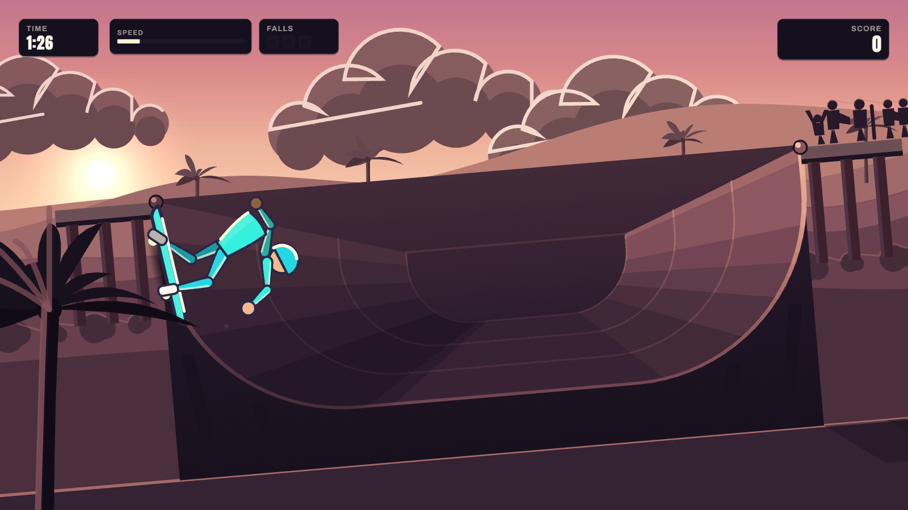
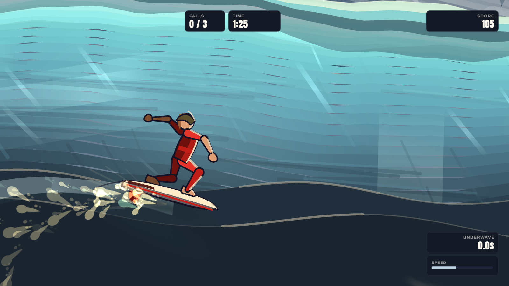
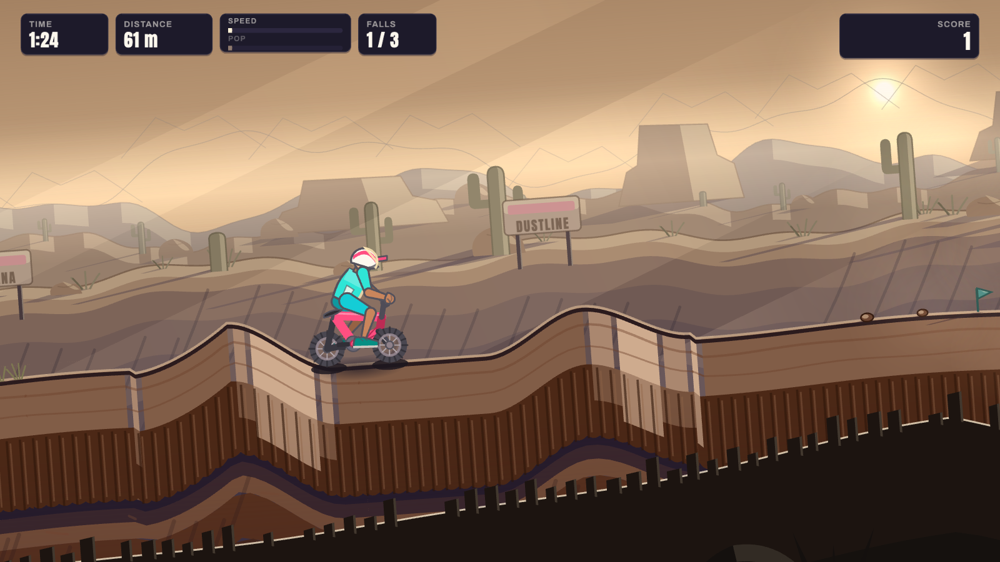
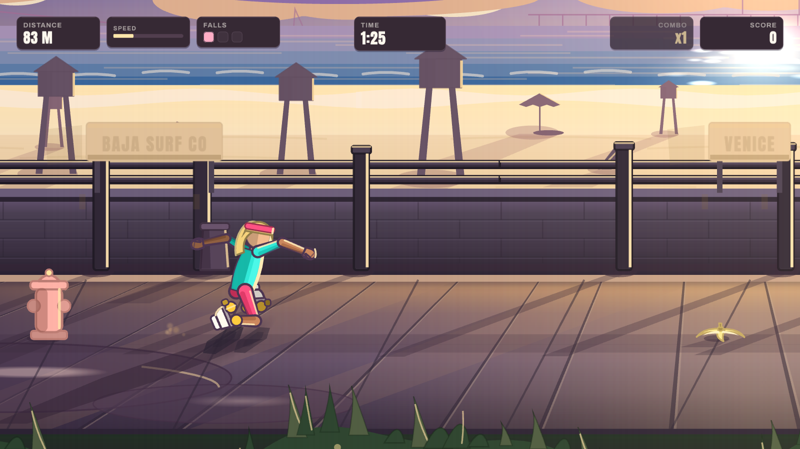
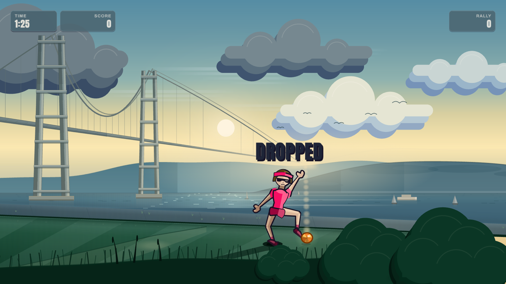
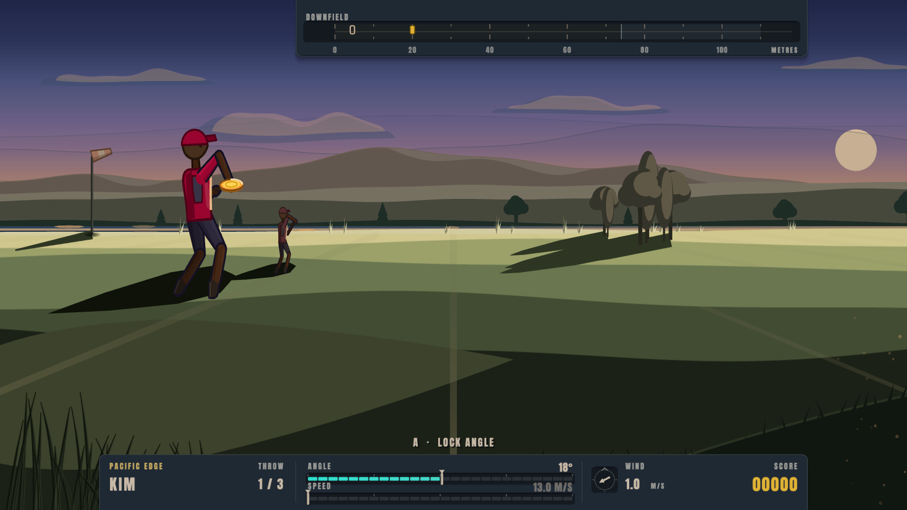

# California Games

A browser remaster of **California Games** (Epyx, 1987) — all six events, built
with Claude in TypeScript and PixiJS.

There are no image files and no audio files. Every shape is drawn as vectors at
runtime and every sound is synthesised on the fly, which is why the whole game
is about 130 KB and starts instantly.

**[▶ Play it in your browser](https://ultrazeus.github.io/claude-games/)**



## The events

|  |  |
|---|---|
| **Half Pipe** — Hollywood, under a purple sky. Pump the transition, air off the lip, land it. | **Surfing** — Ride the pocket, get tubed, launch off the lip. Five judges score the ride. |
|  |  |
| **BMX** — A banked dirt course out in the desert. Air the jumps, spin, land clean. | **Roller Skating** — A boardwalk at golden hour. Clear the cracks, sand and banana skins. |
|  |  |
| **Foot Bag** — A lawn under the Golden Gate. Keep the bag up and chain the named tricks. | **Flying Disc** — Yosemite. Set angle and power against the wind, then run under it and catch. |
|  |  |

## Controls

Each event shows its own controls on screen while you play.

| Key |  |
|---|---|
| **Arrows** | Move, steer, lean, spin |
| **Space** | The main action — jump, grab, pump, throw |
| **Shift** | The second action, where an event has one |
| **Enter** | Start, and play again from a results screen |
| **Esc** | Back to the menu |
| **M** | Music on / off |
| **N** | Wind, surf and tyre noise on / off |

Both audio settings are remembered between sessions.

## How close is it to the original?

Where the 1987 game is documented, this follows it:

- **90-second runs**, not the minute and a quarter that merely feels about right
- **Three falls ends a run** in Half Pipe, Surfing, Skating and BMX — Foot Bag
  is exempt, and the original says so explicitly
- **Three throws** in Flying Disc
- **Foot Bag's named tricks at their original point values** — Doda 5000,
  Squinty O Toole 7500, Double Arch 2500, Horseshoe 500, and Fowl 1000 for
  knocking the seagull out of the sky
- **A judges' results screen after every event**, which is how the original does
  it — the panel is shared, not a Surfing jury

The sponsors are invented. The original plastered real 1987 brands over
everything and that density is part of the look, so this has its own.

## Running it locally

```bash
npm install
npm run dev          # http://localhost:5273
```

```bash
npm run build        # typecheck + production build into dist/
npm run preview      # serve the built bundle
```

Node 18 or newer. No asset pipeline, no environment variables, nothing to
download.

## Reading the code

```
src/core/       App, Loop, Input, Audio, Music, Scene
src/render/     Palette, Hud, Gradient
src/game/ui/    Menu, Results
src/game/events/<event>/
```

Four decisions shaped most of it:

- **The simulation runs at a fixed 1/60 and rendering interpolates between
  ticks**, so the physics is identical on every machine while motion stays
  smooth at any frame rate.
- **Each event owns a palette rather than a set of colours.** One hue family, an
  accent reserved for the athlete, and depth applied by grading instead of fog —
  `src/render/Palette.ts`.
- **Music is a sequencer, not a player.** `src/core/Music.ts` schedules seven
  tunes using Web Audio lookahead, so a busy frame can't make them stutter.
- **The art rules are written down.** `ENGINE.md` covers the value plans and
  composition; `SOURCE-NOTES.md` records what the original does, quoted from the
  source.

## Credits

California Games is © Epyx, 1987. This is an independent, non-commercial remake
built for the love of it. It shares no code or assets with the original and is
not affiliated with or endorsed by any rights holder. If you hold those rights
and would like it taken down, open an issue and it will be.

Code is MIT licensed — see [LICENSE](LICENSE).
